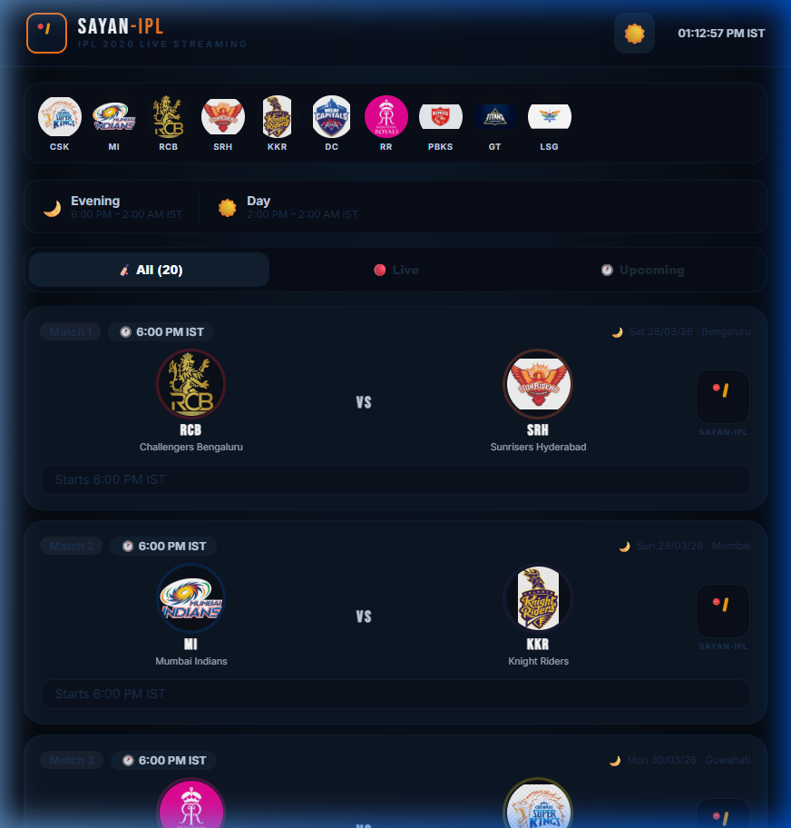
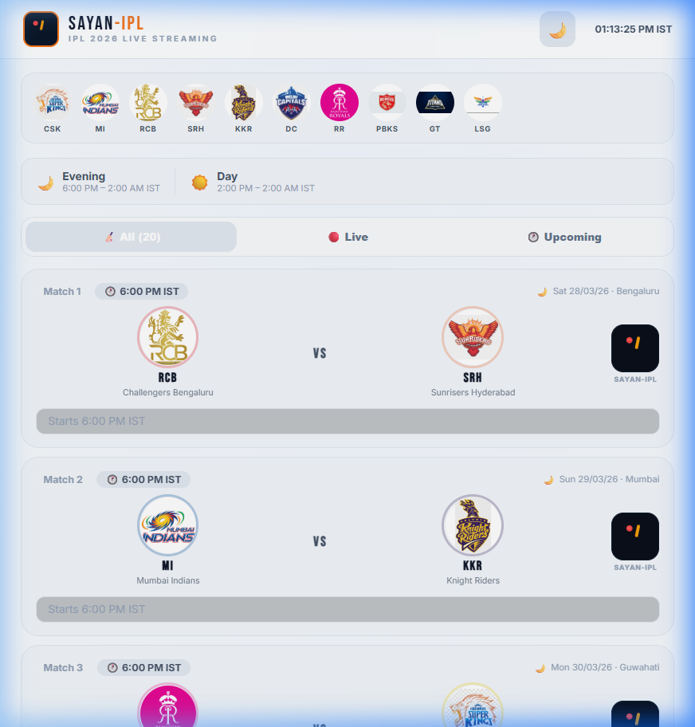

# 🏏 Sayan IPL - 2026 Live Streaming

A premium, high-performance IPL live streaming dashboard built with **React**, **Vite**, and **Vanilla CSS**. This application provides a seamless experience for monitoring live matches, schedules, and team statistics with a stunning modern interface.

## ✨ Key Features

- 🌓 **Dynamic Theming**: Seamlessly switch between a deep-blue Dark Mode and a crisp, modern Light Mode. Your preference is automatically saved!
- 🏆 **Official Team Logos**: Integrated with all 10 official IPL team logos (CSK, MI, RCB, SRH, KKR, DC, RR, PBKS, GT, LSG).
- 📺 **Live Match Alerts**: Real-time "LIVE" indicators and a sleek top navigation strip for quick access.
- 📱 **Fully Responsive**: Optimized for desktop, tablet, and mobile viewing.
- ⚡ **Turbo Performance**: Built with Vite for lightning-fast load times and smooth transitions.
- ☁️ **Deployment Ready**: Fully configured for one-click deployment to **Vercel** or **Cloudflare Pages**.

## 📸 Screenshots

### Dark Mode (Premium Experience)


### Light Mode (Modern & Clean)


## 🛠️ Tech Stack

- **Frontend**: [React 19](https://react.dev/)
- **Build Tool**: [Vite 6](https://vite.dev/)
- **Styling**: Vanilla CSS (CSS Variables)
- **Icons**: Custom SVGs & Lucide-inspired components
- **Deployment**: [Vercel](https://vercel.com/) / [Cloudflare Pages](https://pages.cloudflare.com/)

## 🚀 Getting Started

1. **Clone the repository**:
   ```bash
   git clone https://github.com/sayanpal514-hue/IPL.git
   ```
2. **Install dependencies**:
   ```bash
   npm install
   ```
3. **Run the development server**:
   ```bash
   npm run dev
   ```
4. **Build for production**:
   ```bash
   npm run build
   ```

## 🌐 Live Demo

You can view the live application here: **[sayan-ipl.vercel.app](https://github.com/sayanpal514-hue/IPL)** *(Note: Replace with your actual deployment URL)*

---
Developed with ❤️ by **Sayan Pal**
